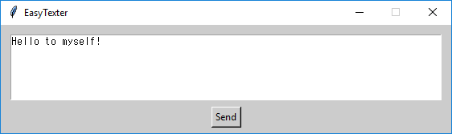

# EasyTexter
EasyTexter is a GUI application for texting from your PC.
  
You can text on your Android smartphone using EasyTexter! Simply type in what you want to type and press "Send". Useful for those who don't like using smartphone keyboards.

## Dependencies
* **[Python](https://www.python.org/)** 3.7+
* **[Android Debug Bridge (adb)](https://developer.android.com/studio/command-line/adb)** (included)

## Example
### GUI

 

### Phone

